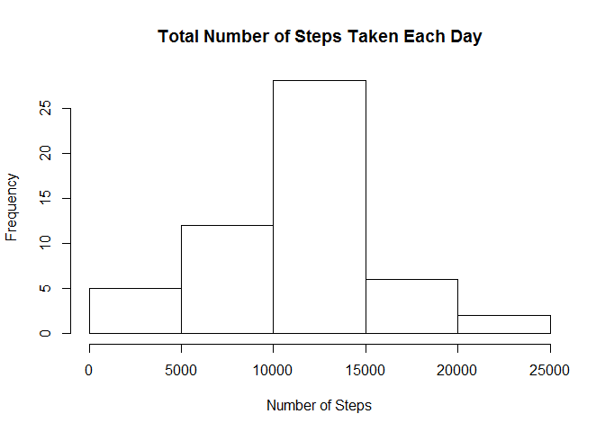
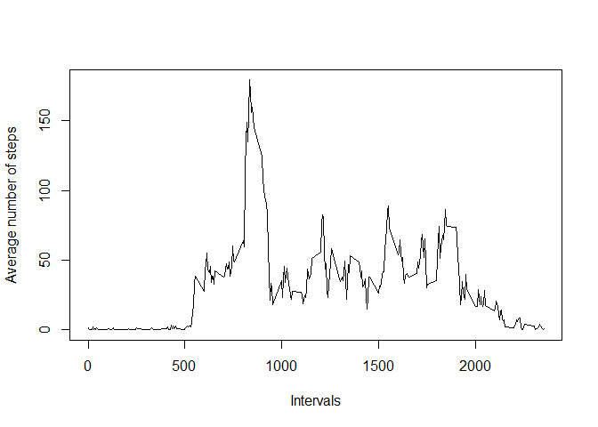
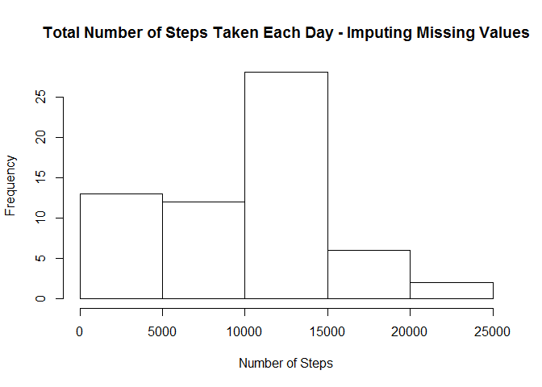
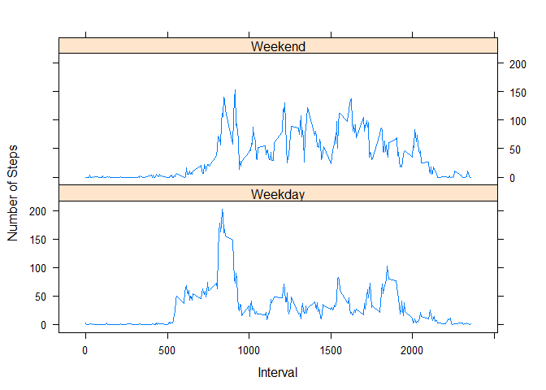

# Reproducible Research: Peer Assessment 1


## Loading and preprocessing the data

```r
zipfile <- unzip("activity.zip")
adata <- read.csv("activity.csv", na.strings = "NA", header = T)
```


## What is mean total number of steps taken per day?

```r
options(scipen=999)
steps <- tapply(adata$steps, adata$date, FUN = sum)
hist(steps, main = "Total Number of Steps Taken Each Day", xlab = "Number of Steps")
```

 

```r
smean <- round(mean (steps, na.rm= T),2)
smedian <- round(median (steps, na.rm = T),2)
```

The mean total number of steps taken each day is 10766.19 and the corresponding median is  10765.

## What is the average daily activity pattern?

```r
adata[is.na(adata)] <- 0 
meanact <- tapply( adata$steps, adata$interval, mean)
ilevels <- levels(factor(adata$interval))
plot(ilevels, meanact, type = "l", xlab = "Intervals", ylab = "Average number of steps")
```

 

```r
maxidx <- which(meanact == max (meanact))
maxlevel <- ilevels[maxidx]
maxlevel_u <- as.numeric(maxlevel) + 5
```
The 5-minute interval , on average across all the days in the dataset, which contains the maximum number of steps is the interval 835 to 840.

## Imputing missing values

```r
totalNAs <- length(is.na(adata))
```
The total number of missing values in the dataset is 52704.

The missing values will be replaced by the mean of the number of steps taken for that  5-minute interval


```r
splitdata <- split(adata$steps, factor(adata$interval))

for (i in 1: length(splitdata)){
    splitdata[[i]][is.na(splitdata[[i]])] <- meanact[[i]]
}


meansteps <- unsplit(splitdata, adata$interval)
meandata <- adata
meandata$steps <- meansteps

MeanDatasteps <- tapply(meandata$steps, meandata$date, FUN = sum)
hist(MeanDatasteps, main = "Total Number of Steps Taken Each Day - Imputing Missing Values", xlab = "Number of Steps")
```

 

```r
MeanData_mean <- round(mean (MeanDatasteps, na.rm= T),2)
MeanData_median <- round(median (MeanDatasteps, na.rm = T),2)
```

The mean total number of steps taken each day is 9354.23 and the corresponding median is  10395.
The values of the mean and median before and after imputing the missing values differ significantly. One obvious implication is that the means and medians have lower values than what they were before imputing the missing values. This could be because now missing values are no longer ignored- so the number of records to be analysed has increased. Therefore as the sample size increases a better approximation is attained for both the values of mean and median.

## Are there differences in activity patterns between weekdays and weekends?

```r
library(lattice)
dow <- as.POSIXlt(as.Date(meandata$date))$wday
meandata$day <- dow
meandata$day <- as.numeric(meandata$day)
meandata$day[meandata$day == 1| meandata$day ==2 | meandata$day ==3 | meandata$day ==4 | meandata$day ==5] <- "Weekday"
meandata$day[meandata$day ==0 | meandata$day ==6] <- "Weekend"
meandata$day <- factor (meandata$day)

weekdayactivity <- tapply(meandata$steps[meandata$day == "Weekday"],meandata$interval[meandata$day == "Weekday"], mean )
weekendactivity <- tapply(meandata$steps[meandata$day == "Weekend"],meandata$interval[meandata$day == "Weekend"], mean)

wdfactor <- factor(c(rep("Weekday", 288), rep("Weekend", 288)))
allweekact <- c(weekdayactivity, weekendactivity)
allweekint <- c(meandata$interval[1:288], meandata$interval[1:288])

allweekdata <- data.frame(allweekact, allweekint, wdfactor)

xyplot(allweekact ~ allweekint | factor(wdfactor), data = allweekdata, layout =c(1,2), type = "l", xlab="Interval", ylab = "Number of Steps")
```

 

From the panel plot, it can be concluded that there is more activity over weekend than weekdays. 
